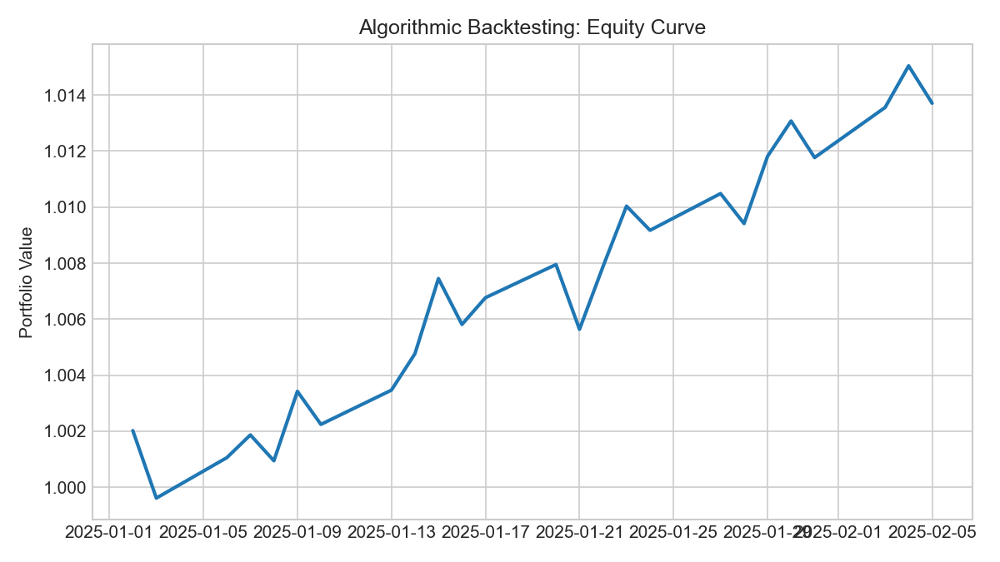
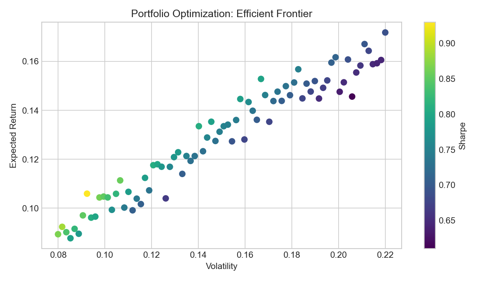
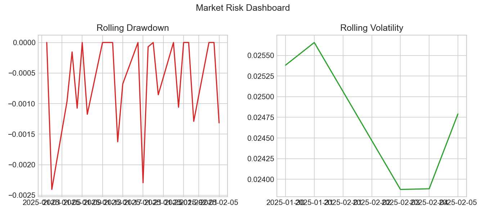
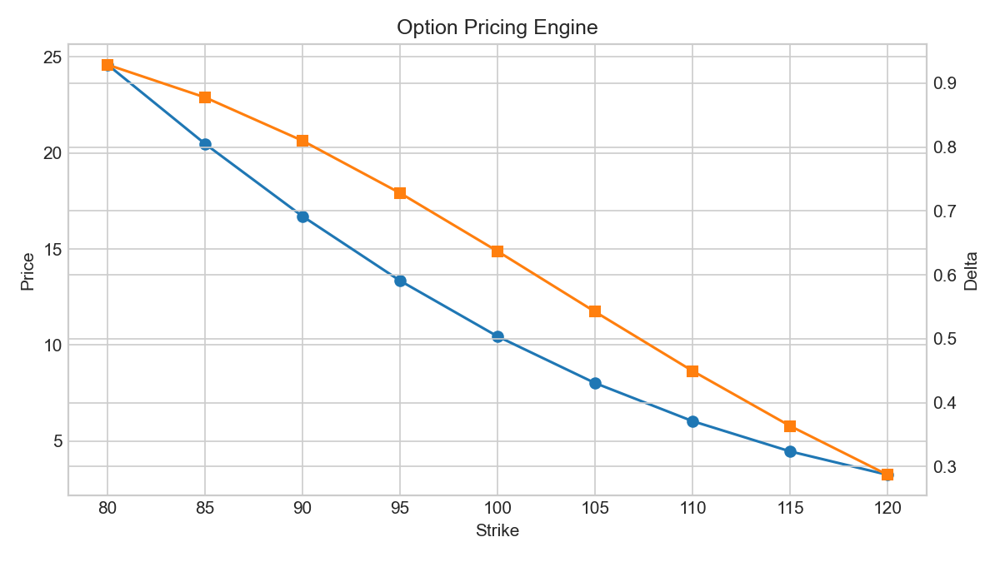
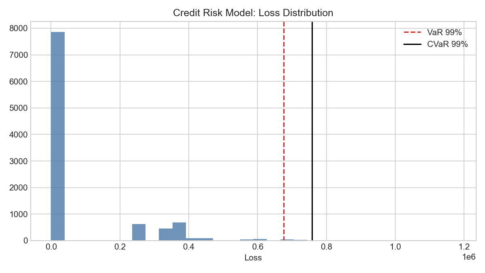

# RiskOptima

[](https://pypi.org/project/riskoptima/)
[](https://pypi.org/project/riskoptima/)
[](https://github.com/JordiCorbilla/RiskOptima/actions/workflows/ci.yml)
[](LICENSE)


RiskOptima is a comprehensive Python toolkit for evaluating, managing, and optimizing investment portfolios. This package is designed to empower investors and data scientists by combining financial risk analysis, backtesting, mean-variance optimization, and machine learning capabilities into a single, cohesive package.

## Stats
https://pypistats.org/packages/riskoptima

## Key Features

- Modular Core: `MarketData`, `Portfolio`, and `BacktestConfig` types for clean workflows.
- Backtesting Framework: Strategy interfaces, cost/slippage modeling, and performance tracking.
- Risk Models: Factor risk model with exposures and factor-based covariance estimation.
- Market Regimes: Gaussian Hidden Markov Models for bull, bear, and sideways regime detection.
- Volatility Toolkit: historical, realized, EWMA, OHLC, and implied volatility estimators.
- Optimization: Mean-variance, efficient frontier, max Sharpe, and constraint handling (bounds, leverage, turnover, factor limits).
- Risk Management: VaR, CVaR, volatility, and drawdown analytics.
- Monte Carlo Simulations: Analyze potential portfolio outcomes. See example here https://github.com/JordiCorbilla/efficient-frontier-monte-carlo-portfolio-optimization
- Market & Allocation Visuals: Correlation matrices, portfolio area charts, and diagnostics.
- Quant Models: Black-Litterman, stochastic volatility models, and options/Greeks analytics.
- Portfolio Projects: algorithmic trading/backtesting, portfolio optimization, market risk dashboard, option pricing engine, and credit risk model workflows.

## What's New

- Professional options analytics: `OptionContract`, `OptionBook`, option book valuation, Greek aggregation, scenario grids, implied-vol surfaces, and event straddle analysis.
- Hardened optimizer constraints: optional `OptimizationResult`, leverage limits, turnover limits, factor bounds, sector bounds, asset-class bounds, and covariance helpers.
- Risk attribution and scenario analytics: component volatility/VaR/CVaR, factor risk contribution, tracking error contribution, deterministic stress scenarios, and scenario sets.
- New synthetic examples: `examples/example_option_book_analytics.py`, `examples/example_optimizer_constraints.py`, and `examples/example_risk_attribution_scenarios.py`.
- New docs: `docs/options_analytics.md`, `docs/optimizer_constraints.md`, and `docs/risk_attribution_and_scenarios.md`.

## Quant Portfolio Project Map

| Project | Notebook / Example | Package API | Screenshot |
|---|---|---|---|
| Algorithmic Trading Backtester | `05-portfolio_sma_strategy.ipynb` | `riskoptima.backtest` |  |
| Portfolio Optimization | `02-portfolio_optimization_riskoptima.ipynb`, `09-portfolio_sophistication_report_demo.ipynb` | `riskoptima.optim`, `riskoptima.reporting` |  |
| Market Risk Dashboard | `examples/example_market_risk_dashboard.py`, `10-markov_regime_model_demo.ipynb`, `11-portfolio_markov_regime_demo.ipynb`, `12-volatility_toolkit_demo.ipynb` | `riskoptima.reporting`, `riskoptima.risk`, `riskoptima.volatility` |  |
| Option Pricing Engine | `examples/example_option_pricing_engine.py`, `12-volatility_toolkit_demo.ipynb` | `riskoptima.options`, `riskoptima.volatility` |  |
| Credit Risk Model | `08-credit_risk_model_demo.ipynb` | `riskoptima.credit` |  |

See `docs/quant_project_map.md` for a recruiter/interviewer-friendly walkthrough of the five projects.

## Installation

See the project here: https://pypi.org/project/riskoptima/

```
pip install riskoptima
```
## Usage

### New modular API (backtest + factor risk + constraints)

```python
import pandas as pd
from riskoptima import FactorRiskModel, Constraints, optimize_max_sharpe
from riskoptima import SMACrossStrategy, run_backtest, BacktestConfig, SimpleCostModel

# prices: DataFrame with Date index and asset columns
prices = pd.read_csv("prices.csv", index_col=0, parse_dates=True)
asset_returns = prices.pct_change().dropna()

# factors: Fama-French returns DataFrame (e.g. from RiskOptima.get_fff_returns)
factors = pd.read_csv("fama_french_factors.csv", index_col=0, parse_dates=True)

factor_model = FactorRiskModel(factor_returns=factors).fit(asset_returns)
factor_cov = factor_model.covariance_matrix()

constraints = Constraints(factor_bounds={"MKT": (-0.2, 0.8)})
weights = optimize_max_sharpe(
    expected_returns=asset_returns.mean() * 252,
    cov=factor_cov,
    constraints=constraints,
    factor_exposures=factor_model.exposures,
    risk_free_rate=0.02,
)

strategy = SMACrossStrategy(short_window=20, long_window=50)
config = BacktestConfig(initial_cash=1_000_000, rebalance_rule="D")
cost_model = SimpleCostModel(spread_bps=2.0, impact_coeff=0.0)
equity_curve, weights_history = run_backtest(prices, strategy, config, cost_model)
```

See `examples/example_factor_backtest.py` for a runnable end-to-end example.

### SMA Crossover Strategy

RiskOptima includes reusable SMA crossover helpers for a simple long-only trend-following workflow. The short moving average crossing above the long moving average creates an entry signal; a bearish cross, stop loss, or take profit closes the trade.

```python
from riskoptima.backtest import build_sma_signal_frame, run_sma_strategy_with_risk

signals = build_sma_signal_frame(prices[["Close"]], short_window=20, long_window=50)
trades = run_sma_strategy_with_risk(
    "SPY",
    start="2024-01-01",
    end="2025-01-01",
    stop_loss=0.05,
    take_profit=0.10,
)
```

The notebook `05-portfolio_sma_strategy.ipynb` shows single-asset, equal-weight multi-asset, and custom-weight portfolio runs.

### Offline sample datasets

RiskOptima includes small synthetic datasets for deterministic examples:

- `data/synthetic_market_returns.csv`
- `data/synthetic_credit_portfolio.csv`

These are intentionally small and have no external data dependency.

### Credit Risk Model

RiskOptima includes a production-ready credit risk layer for PD/LGD/EAD portfolios, expected loss, unexpected loss, rating migration, Merton structural default probability, and Credit VaR/CVaR Monte Carlo.

```python
import pandas as pd
from riskoptima.credit import (
    expected_loss,
    portfolio_expected_loss,
    simulate_credit_losses,
    credit_var,
    credit_cvar,
    merton_pd,
)

portfolio = pd.DataFrame({
    "obligor": ["A", "B", "C"],
    "PD": [0.01, 0.025, 0.04],
    "LGD": [0.40, 0.45, 0.55],
    "EAD": [1_000_000, 750_000, 500_000],
})

print(expected_loss(0.02, 0.45, 1_000_000))
print(portfolio_expected_loss(portfolio))

losses = simulate_credit_losses(portfolio, n_sims=20_000, random_state=42)
print(credit_var(losses, confidence=0.99))
print(credit_cvar(losses, confidence=0.99))
print(merton_pd(asset_value=150, debt_face_value=100, asset_vol=0.25, risk_free_rate=0.03, maturity=1.0))
```

See `08-credit_risk_model_demo.ipynb` for an end-to-end notebook.

### Market Risk Dashboard

RiskOptima can build a dashboard-ready market risk report with annualized return, volatility, Sharpe, Sortino, drawdown, historical VaR, Gaussian VaR, CVaR/expected shortfall, beta, tracking error, information ratio, rolling volatility, and rolling drawdown.

Screenshot placeholder: `plots/market_risk_dashboard.png`

```python
import pandas as pd
from riskoptima.reporting import build_market_risk_report

returns = pd.DataFrame({
    "AssetA": [0.01, -0.005, 0.004, 0.002],
    "AssetB": [0.002, 0.003, -0.006, 0.005],
})
weights = pd.Series({"AssetA": 0.6, "AssetB": 0.4})

report = build_market_risk_report(returns, weights=weights, confidence_levels=(0.95, 0.99))
print(report.metrics["annualized_volatility"])
print(report.metrics["historical_var"][0.99])
```

Run `examples/example_market_risk_dashboard.py` to generate a multi-panel dashboard.

Optional Streamlit dashboard:

```bash
pip install streamlit
streamlit run examples/streamlit_market_risk_dashboard.py
```

### Markov Market Regime Model

RiskOptima includes a Gaussian Hidden Markov Model workflow for identifying latent market regimes from return data. The report exposes the fitted transition matrix, regime probabilities, most likely regime path, summary statistics, and a chart that colors cumulative performance by inferred regime.

```python
import numpy as np
import pandas as pd
from riskoptima.reporting import build_markov_regime_report, plot_markov_regime_chart

rng = np.random.default_rng(42)
returns = pd.Series(
    np.r_[
        rng.normal(0.0005, 0.006, 120),
        rng.normal(-0.0010, 0.018, 80),
        rng.normal(0.0009, 0.008, 120),
    ],
    index=pd.bdate_range("2022-01-03", periods=320),
)

report = build_markov_regime_report(returns, n_regimes=3, random_state=42)
print(report.metrics["transition_matrix"])
print(report.metrics["regime_summary"])

ax = plot_markov_regime_chart(report)
ax.figure.savefig("markov_regime_chart.png", dpi=150, bbox_inches="tight")
```

To run the same regime model on a portfolio, convert asset returns into a single portfolio return series first:

```python
asset_returns = pd.DataFrame({
    "SPY": rng.normal(0.0004, 0.010, 320),
    "TLT": rng.normal(0.0001, 0.007, 320),
    "GLD": rng.normal(0.0002, 0.009, 320),
}, index=pd.bdate_range("2022-01-03", periods=320))

weights = pd.Series({"SPY": 0.60, "TLT": 0.30, "GLD": 0.10})
portfolio_returns = asset_returns.dot(weights)

portfolio_regime_report = build_markov_regime_report(
    portfolio_returns,
    input_type="returns",
    n_regimes=3,
    random_state=42,
)
```

See `10-markov_regime_model_demo.ipynb` for the market-index workflow and `11-portfolio_markov_regime_demo.ipynb` for the portfolio workflow.

### Portfolio Sophistication Report

RiskOptima can recreate the portfolio comparison chart shown in the "Mas sofisticacion = mejor portfolio?" discussion: cumulative wealth curves plus a table of return, volatility, drawdown, Sharpe, Calmar, Omega, Sortino, skew, kurtosis, tail ratio, common sense ratio, and VaR. The default methods compare minimum variance, tail-risk, drawdown-risk, return-to-risk, and equal-weight baselines.

```python
import pandas as pd
from riskoptima.reporting import (
    build_portfolio_sophistication_report,
    plot_portfolio_sophistication_report,
)

returns = pd.DataFrame({
    "MO": [0.004, -0.003, 0.002, 0.001],
    "NWN": [0.002, 0.001, -0.001, 0.003],
    "PEP": [0.003, -0.002, 0.004, 0.001],
    "KO": [0.002, -0.001, 0.003, 0.002],
})

report = build_portfolio_sophistication_report(
    returns,
    methods=("MV", "CVaR", "EVaR", "CDaR", "MDD", "1N"),
    confidence=0.95,
)
print(report.metrics["weights"])
print(report.metrics["performance_table"])

fig = plot_portfolio_sophistication_report(report)
fig.savefig("portfolio_sophistication_report.png", dpi=150, bbox_inches="tight")
```

See `09-portfolio_sophistication_report_demo.ipynb` for a reproducible notebook using the existing defensive stock portfolio.

### Option Pricing Engine

The clean options API covers Black-Scholes call/put pricing, Greeks, implied volatility, binomial trees, and Monte Carlo European option pricing while preserving the legacy `RiskOptima` class methods.

```python
import pandas as pd
from riskoptima.options import (
    black_scholes_price,
    black_scholes_greeks,
    implied_volatility,
    monte_carlo_european_option,
)

S, K, T, r, sigma = 100, 100, 1.0, 0.05, 0.20
call = black_scholes_price(S, K, T, r, sigma, option_type="call")
put = black_scholes_price(S, K, T, r, sigma, option_type="put")
greeks = pd.Series(black_scholes_greeks(S, K, T, r, sigma, option_type="call"))
iv = implied_volatility(call, S, K, T, r, option_type="call")
mc = monte_carlo_european_option(S, K, T, r, sigma, option_type="call", random_state=42)

print(call, put)
print(greeks)
print(iv, mc)
```

Run `examples/example_option_pricing_engine.py` for a full pricing comparison.

### Volatility Toolkit

RiskOptima includes a clean volatility API for close-to-close, intraday, OHLC, and option-implied volatility workflows.

```python
import pandas as pd
from riskoptima.volatility import (
    ewma_volatility,
    garman_klass_volatility,
    historical_volatility,
    implied_volatility,
    parkinson_volatility,
    realized_volatility,
    rolling_volatility,
)

prices = pd.Series([100.0, 101.2, 100.4, 102.1, 101.7])
returns = prices.pct_change().dropna()

print(historical_volatility(returns, input_type="returns"))
print(rolling_volatility(returns, window=3))
print(realized_volatility(prices, input_type="prices"))
print(ewma_volatility(returns))

ohlc = pd.DataFrame({
    "Open": [100.0, 101.0, 100.5],
    "High": [102.0, 102.5, 103.0],
    "Low": [99.5, 100.2, 99.8],
    "Close": [101.0, 100.5, 102.0],
})
print(parkinson_volatility(ohlc))
print(garman_klass_volatility(ohlc))
print(implied_volatility(10.45, 100, 100, 1.0, 0.05))
```

See `12-volatility_toolkit_demo.ipynb` for a reproducible notebook.

### Example 1: Setting up your portfolio

Create your portfolio table similar to the below:

| Asset | Weight | Label                         | MarketCap |
|-------|--------|-------------------------------|-----------|
| MO    | 0.04   | Altria Group Inc.             | 110.0e9   |
| NWN   | 0.14   | Northwest Natural Gas         | 1.8e9     |
| BKH   | 0.01   | Black Hills Corp.             | 4.5e9     |
| ED    | 0.01   | Con Edison                    | 30.0e9    |
| PEP   | 0.09   | PepsiCo Inc.                  | 255.0e9   |
| NFG   | 0.16   | National Fuel Gas             | 5.6e9     |
| KO    | 0.06   | Coca-Cola Company             | 275.0e9   |
| FRT   | 0.28   | Federal Realty Inv. Trust     | 9.8e9     |
| GPC   | 0.16   | Genuine Parts Co.             | 25.3e9    |
| MSEX  | 0.05   | Middlesex Water Co.           | 2.4e9     |

```python
import pandas as pd
from riskoptima import RiskOptima

import warnings
warnings.filterwarnings(
    "ignore", 
    category=FutureWarning, 
    message=".*DataFrame.std with axis=None is deprecated.*"
)

# Define your current porfolio with your weights and company names
asset_data = [
    {"Asset": "MO",    "Weight": 0.04, "Label": "Altria Group Inc.",       "MarketCap": 110.0e9},
    {"Asset": "NWN",   "Weight": 0.14, "Label": "Northwest Natural Gas",   "MarketCap": 1.8e9},
    {"Asset": "BKH",   "Weight": 0.01, "Label": "Black Hills Corp.",         "MarketCap": 4.5e9},
    {"Asset": "ED",    "Weight": 0.01, "Label": "Con Edison",                "MarketCap": 30.0e9},
    {"Asset": "PEP",   "Weight": 0.09, "Label": "PepsiCo Inc.",              "MarketCap": 255.0e9},
    {"Asset": "NFG",   "Weight": 0.16, "Label": "National Fuel Gas",         "MarketCap": 5.6e9},
    {"Asset": "KO",    "Weight": 0.06, "Label": "Coca-Cola Company",         "MarketCap": 275.0e9},
    {"Asset": "FRT",   "Weight": 0.28, "Label": "Federal Realty Inv. Trust", "MarketCap": 9.8e9},
    {"Asset": "GPC",   "Weight": 0.16, "Label": "Genuine Parts Co.",         "MarketCap": 25.3e9},
    {"Asset": "MSEX",  "Weight": 0.05, "Label": "Middlesex Water Co.",       "MarketCap": 2.4e9}
]
asset_table = pd.DataFrame(asset_data)

capital = 100_000

asset_table['Portfolio'] = asset_table['Weight'] * capital

ANALYSIS_START_DATE = RiskOptima.get_previous_year_date(RiskOptima.get_previous_working_day(), 1)
ANALYSIS_END_DATE   = RiskOptima.get_previous_working_day()
BENCHMARK_INDEX     = 'SPY'
RISK_FREE_RATE      = 0.05
NUMBER_OF_WEIGHTS   = 10_000
NUMBER_OF_MC_RUNS   = 1_000
```

### Example 1: Creating a Portfolio Area Chart

If you want to know visually how's your portfolio doing right now

```python
RiskOptima.create_portfolio_area_chart(
    asset_table,
    end_date=ANALYSIS_END_DATE,
    lookback_days=2,
    title="Portfolio Area Chart"
)
```


### Example 2: Efficient Frontier - Monte Carlo Portfolio Optimization
```python
RiskOptima.plot_efficient_frontier_monte_carlo(
    asset_table,
    start_date=ANALYSIS_START_DATE,
    end_date=ANALYSIS_END_DATE,
    risk_free_rate=RISK_FREE_RATE,
    num_portfolios=NUMBER_OF_WEIGHTS,
    market_benchmark=BENCHMARK_INDEX,
    set_ticks=False,
    x_pos_table=1.15,    # Position for the weight table on the plot
    y_pos_table=0.52,    # Position for the weight table on the plot
    title=f'Efficient Frontier - Monte Carlo Simulation {ANALYSIS_START_DATE} to {ANALYSIS_END_DATE}'
)
```


### Example 3: Portfolio Optimization using Mean Variance and Machine Learning
```python
RiskOptima.run_portfolio_optimization_mv_ml(
    asset_table=asset_table,
    training_start_date='2022-01-01',
    training_end_date='2023-11-27',
    model_type='Linear Regression',    
    risk_free_rate=RISK_FREE_RATE,
    num_portfolios=100000,
    market_benchmark=[BENCHMARK_INDEX],
    max_volatility=0.25,
    min_weight=0.03,
    max_weight=0.2
)
```


### Example 4: Portfolio Optimization using Probability Analysis
```python
RiskOptima.run_portfolio_probability_analysis(
    asset_table=asset_table,
    analysis_start_date=ANALYSIS_START_DATE,
    analysis_end_date=ANALYSIS_END_DATE,
    benchmark_index=BENCHMARK_INDEX,
    risk_free_rate=RISK_FREE_RATE,
    number_of_portfolio_weights=NUMBER_OF_WEIGHTS,
    trading_days_per_year=RiskOptima.get_trading_days(),
    number_of_monte_carlo_runs=NUMBER_OF_MC_RUNS
)
```


### Example 5: Macaulay Duration

```python
from riskoptima import RiskOptima
cf = RiskOptima.bond_cash_flows_v2(4, 1000, 0.06, 2)  # 2 years, semi-annual, hence 4 periods
md_2 = RiskOptima.macaulay_duration_v3(cf, 0.05, 2)
md_2
```


### Example 6:  Market Turns with SPY & VIX Divergence

```python
ANALYSIS_START_DATE = RiskOptima.get_previous_year_date(RiskOptima.get_previous_working_day(), 1)
ANALYSIS_END_DATE   = RiskOptima.get_previous_working_day()

df_signals, df_exits, returns = RiskOptima.run_index_vol_divergence_signals(start_date=ANALYSIS_START_DATE, 
                                                                            end_date=ANALYSIS_END_DATE)
```


## Documentation

For complete documentation and usage examples, visit the GitHub repository:

[RiskOptima GitHub](https://github.com/JordiCorbilla/RiskOptima)

## Contributing

We welcome contributions! If you'd like to improve the package or report issues, please visit the GitHub repository.

## License

RiskOptima is licensed under the MIT License.

### Support me

<a href="https://www.buymeacoffee.com/jordicorbilla" target="_blank"></a>
